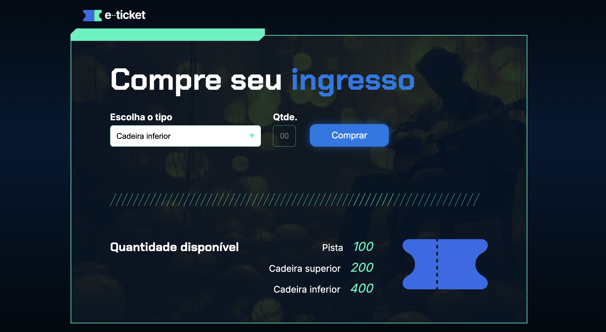

## Screenshots
 

 uma página para comprar ingressos e consultar quantos ainda tem de cada pista.

## Interface
* No `menu`, escollhemos um dos tres tipos de ingresso.
* Ao clicarmos na caixa de `Qtde`, podemos escolher e informar qual a quantidade queremos de cada item.
* Ao clicarmos na caixa de `Comprar`, aparecerá uma mensagem dizendo que a compra foi realizada com sucesso ou não, dependendo da quantidade que tem disponivel.
* É possivel verificar quantos ingressos ainda tem disponivel na lista abaixo do botao principal.
  
## Tecnologias
* HTML
* CSS
* JavaScript
